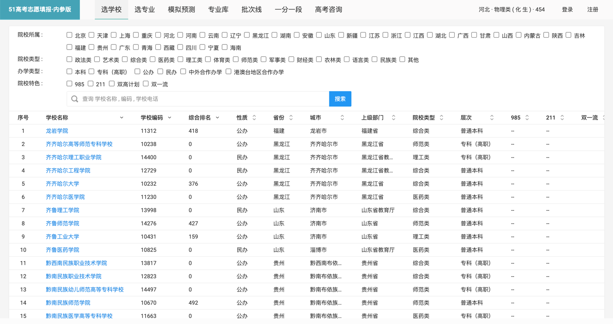
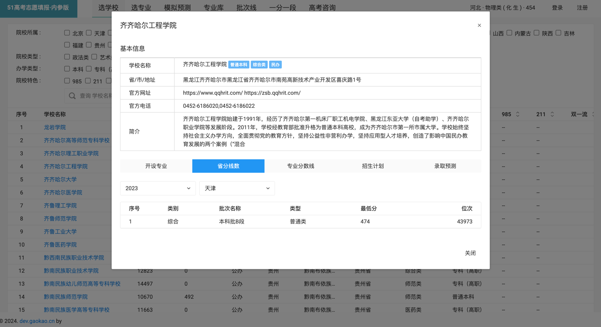
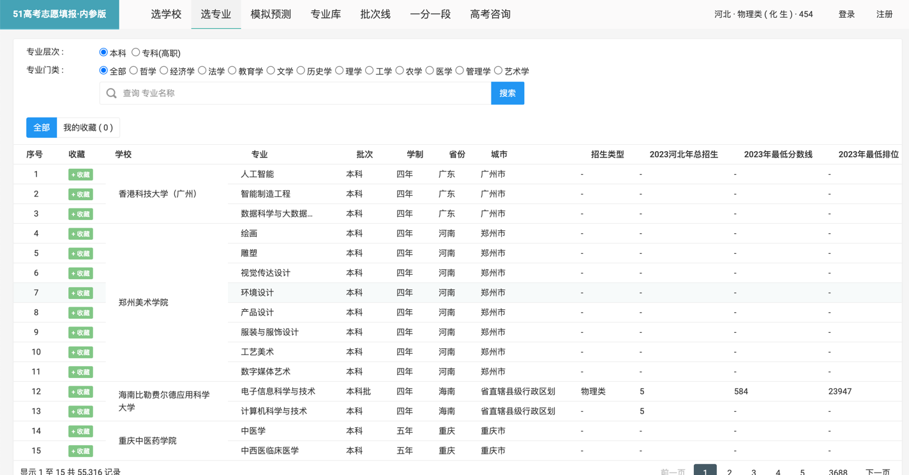
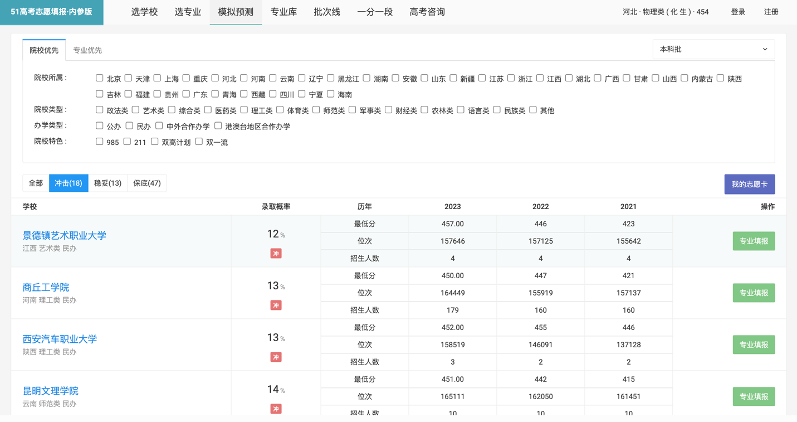
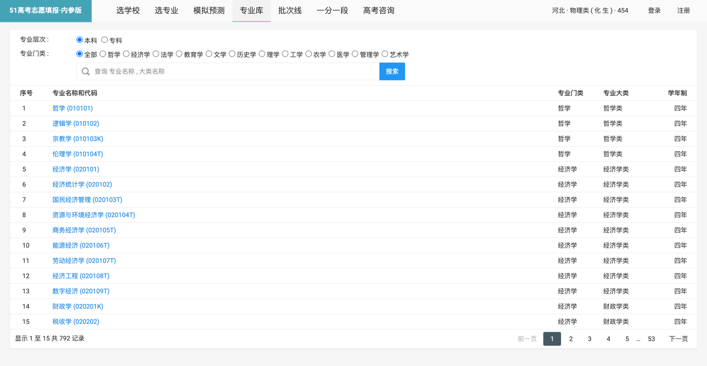
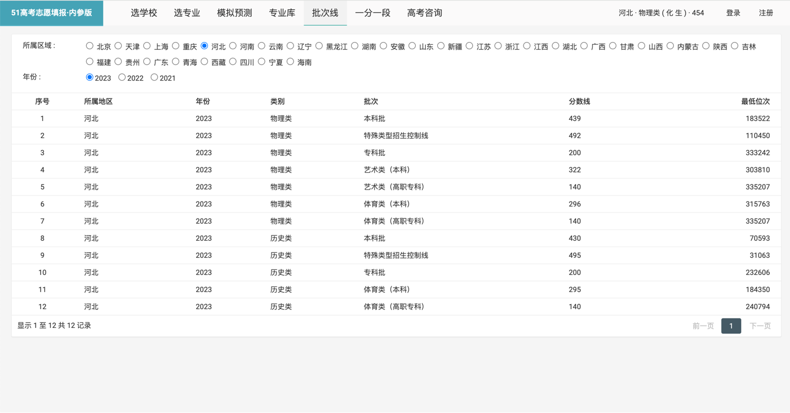
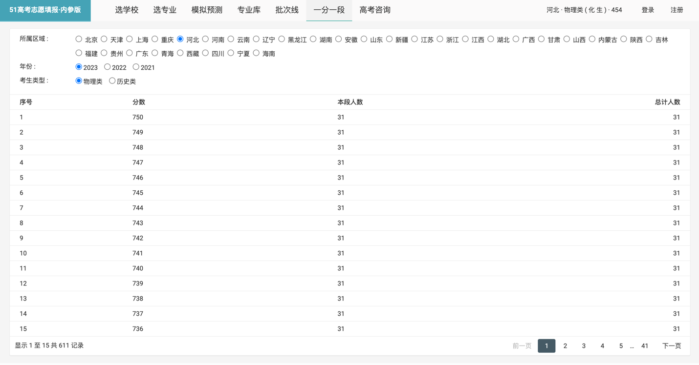

# 高考志愿填报模拟

#### 介绍
模拟高考志愿填报 , 全国2000多所高校查询 , 没有广告 , 有的就是简洁的数据展示
#### 软件架构
CI4.0

#### 安装教程

1.  apache 环境安装
2.  composer 安装

#### 使用说明

#### 联系我

1.  源码完全开源, 但请勿商用, 如果商用造成后果请自行承担.
2.  邮箱: dlj899@163.com
3.  网址: gk.wanyutv.com
